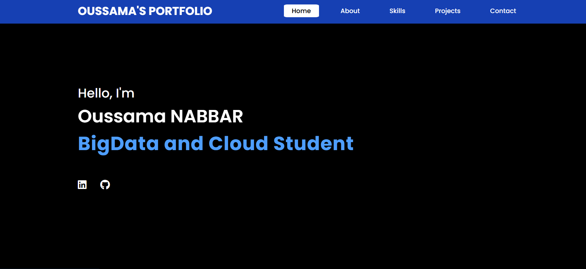
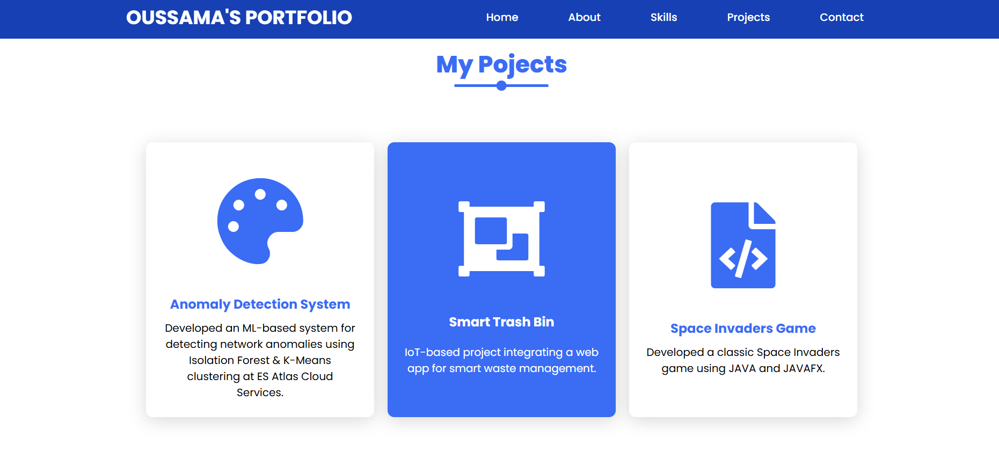
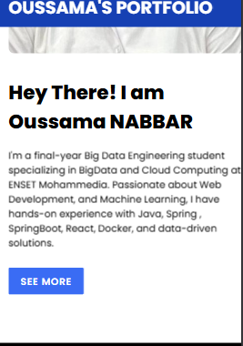

# Oussama NABBAR - Portfolio

### Structure du projet :
index.html : Page principale contenant la structure du site avec un script integré.
styles.css : Fichier CSS pour le design et la mise en page.

### Déploiement et accès :
### Cloner mon dépôt :
```
git clone https://github.com/mreckah/My_Portfolio.git
```
### Technologies utilisées :
HTML5 & CSS3 : Pour la structure et le design responsive.
JavaScript : Pour les interactions et animations.

### Fonctionnalités :
Présentation personnelle : Introduction et informations sur mon parcours.
Projets : Une section détaillant mes projets avec images et descriptions.
Compétences : Liste des technologies et outils maîtrisés.
Contact : Formulaire pour me contacter directement.

### Démonstration :




###Version Telephone: 




